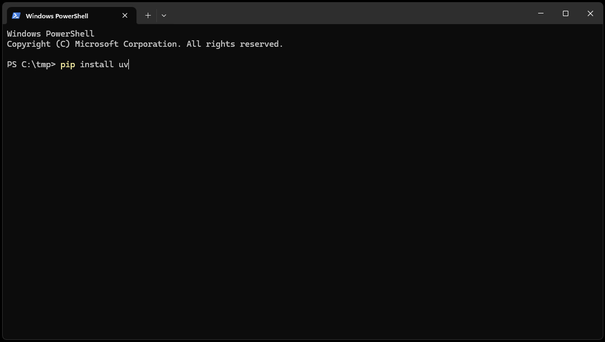
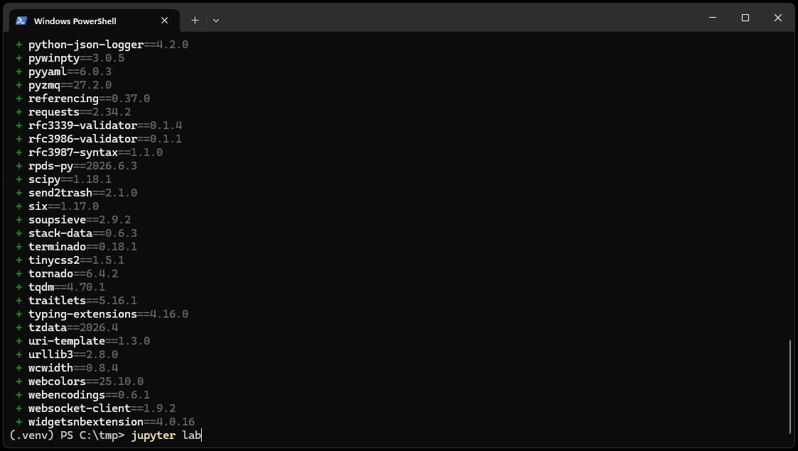

Installing Python
=================

This guide explains how to install Python on Windows.

Installing Python on Windows
----------------------------

The current Python documentation recommends the Python Install Manager
for installations obtained directly from the Python project.

.. important::
   Install Python 3.11 or later, as earlier versions may not be compatible with the course materials.

#. Open the Python downloads page:

   `Download Python <https://www.python.org/downloads/>`_

#. Download the Python Install Manager.

#. Open the downloaded installation file.

#. Follow the installation instructions.

#. Open a new Command Prompt or PowerShell window.

#. Verify the installation:

   .. code-block:: powershell

      python --version

Getting Started
------------------

This course uses ``uv`` to manage Python packages and environments.

Start by going to the directory where you want to create your course environment.

.. tip::
   You can open a terminal in the desired directory by holding down the **Shift** key, right-clicking in the folder, and selecting **Open PowerShell window here**.

Then, install ``uv`` by running the following command in your terminal or command prompt:

.. code-block:: powershell

        pip install uv

It should look something like this:

Once ``uv`` is installed, you can create a new environment by running the following command:

.. code-block:: powershell

        uv venv .venv

After installation, active the environment by running:

.. code-block:: powershell

        .venv/Scripts/activate

.. note::
   If you are using Command Prompt, you may need quotes around the command, use ``".\.venv\Scripts\activate"`` instead.

Once you have activated the environment a ``(.venv)`` prefix will appear in your terminal, indicating that the environment is active. You can now run Python code and install additional packages as needed. Install the required packages for this course, including Jupyter Lab, by running:

.. code-block:: powershell

        uv pip install jupyterlab gwrefpy pastas tqdm ipywidgets tornado==6.4.2

and start Jupyter Lab by running:

.. code-block:: powershell

        jupyter lab

You terminal should look something like this:

After executing the ``jupyter lab`` command an instance of Jupyter Lab will open in your default web browser, where you can create new notebooks or open existing ones.

Additional information on installing and using Jupyter Lab can be found in the `official docmumentation <https://jupyter.org/install>`_.

Continue to :doc:`jupyter_notebooks` to run the final checks.